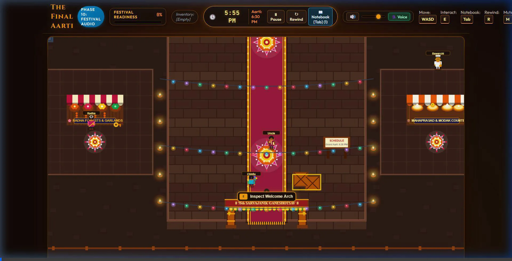
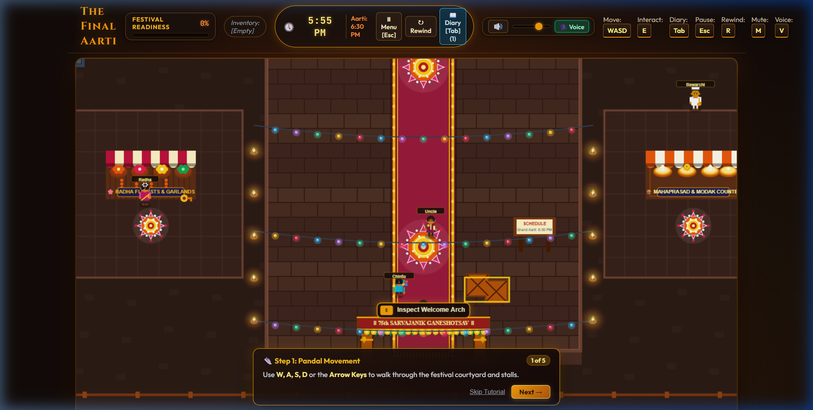

# The Final Aarti - Ganesh Festival Adventure
### *A 2D Narrative Time-Loop Adventure Celebrating Sarvajanik Ganeshotsav*

[](#)
[](#)
[](#)
[](#)

---

## 🎬 Live Demo & Gameplay Preview

> 🌟 **Playable Browser Demo**: Currently running live on [https://final-aarti.netlify.app/](https://final-aarti.netlify.app/) or open `index.html` directly in any modern browser!


*Figure 1: Live gameplay demonstration showing festival pandal exploration, NPC interaction, Volunteer Diary (`Tab`), and sacred time-loop rewind (`R`).*


*Figure 2: The Final Aarti title screen, illuminated pandal entrance, and festival HUD.*


## 🪔 Overview & Elevator Pitch

**The Final Aarti** is an immersive 2D narrative time-loop adventure inspired by India's historic **Sarvajanik Ganeshotsav** festival. 

You play as **Aarav**, a devoted pandal volunteer arriving at **5:55 PM** on the auspicious final evening. The grand community **Aarti** is scheduled for **6:30 PM sharp**, before the magnificent idol of **Lord Shri Ganesh**. However, a cascade of festival emergencies threatens the ceremony: incoming crowds are blocked at the gates, sudden monsoon rain threatens an unshielded electrical conduit near the generator, and the kitchen is missing fresh grated coconut for the sacred offering of 108 ukadiche modaks.

If disaster strikes or preparations remain incomplete at 6:30 PM, a divine temporal rewind returns Aarav to **5:55 PM**. Armed with memories and clues permanently documented in his **Volunteer Diary**, you must piece together the timeline, solve causal mysteries, achieve **100% Festival Readiness**, and deliver the most glorious final Aarti the neighborhood has ever witnessed!

---

## 🌺 Cultural Context & Narrative Design

Founded in Maharashtra by Lokmanya Bal Gangadhar Tilak, **Sarvajanik Ganeshotsav** is more than a religious rite—it is a communal festival uniting people across society through shared seva (service), traditional arts, music, and devotion.

In *The Final Aarti*, every character, object, and ambient sound reflects genuine festival traditions:
- **Ramesh the Electrician**: Straining to manage stage wiring and generator cables amidst unpredictable monsoon showers.
- **Bawarchi Mohan**: The master cook painstakingly steaming 108 handmade *ukadiche modaks* (sweet steamed rice-flour dumplings filled with jaggery and fresh coconut).
- **Radha the Flower Seller**: Weaving 11-foot fragrant marigold (*genda*) and red rose garlands (*haar*) for Ganesha's sanctum.
- **Uncle Sharma**: The tireless committee organizer whose brass keys unlock backstage supply lockers.
- **Dada Ramakant**: A frail neighborhood elder seeking help to reach the sanctum carpet before prayer begins.
- **Sundar the Musician**: Rhythmic dholak and dhol drummer providing festive heartbeat.

---

## ↻ The Sacred Time-Loop Mechanic

1. **The Real-Time Festival Clock (5:55 PM – 6:30 PM)**:
   - The festival runs continuously in real-time. Key events occur at exact scheduled intervals:
     - **5:55 PM**: Pandal doors open; morning volunteers depart.
     - **6:00 PM**: Devotee crowd arrives; cargo crates block the eastern detour route.
     - **6:05 PM**: Ramesh tests stage spotlights.
     - **6:08 PM**: Light monsoon rain begins to fall.
     - **6:10 PM**: Ramesh leaves his post for cutting chai; unshielded 415V cable shorts if unaddressed!
     - **6:15 PM**: Prasad counter opens for modak distribution.
     - **6:30 PM**: The moment of the **Grand Aarti**.
2. **Failure & Voluntary Rewind**:
   - If a blackout occurs or readiness falls short at 6:30 PM, the timeline rewinds to 5:55 PM with chromatic aberration, reversing clock hands, and an inward particle vortex.
   - Players can also press **[R]** anytime to voluntarily rewind the evening once key clues are acquired.
3. **The Persistent 6-Section Volunteer Diary**:
   - Every character spoken to, place explored, hazard discovered, and puzzle solved is permanently etched into the player's diary across all time loops:
     - 👥 **People**: Roles, routines, and personalities.
     - 📍 **Places**: Mandap altar, electrical zone, prasad stall, flower booth, welcome gate.
     - 📦 **Objects**: Damaged cable, generator, notice board, storage cabinet, deepstambh.
     - ⏰ **Events**: Timed schedule milestones witnessed firsthand.
     - 💡 **Clues**: Actionable deductions that unlock puzzle interactions.
     - 🏆 **Solved**: Causal loops permanently resolved.

---

## 🧩 The Three Causal Mystery Chains

To save the festival, Aarav must resolve three interconnected crises across the evening:

| Mystery | The Hazard / Obstacle | The Solution Chain | Readiness Reward |
| :--- | :--- | :--- | :---: |
| **1. Crowd Bottleneck** | At 6:00 PM, heavy devotee inflow bottlenecks at the eastern archway due to mislaid crates. | Inspect crates $\to$ speak to Volunteer Priya $\to$ push crates clear before 6:00 PM to open the detour route. | **+20%** |
| **2. Electrical Blackout** | At 6:08 PM, monsoon rain floods a mud ditch containing a cracked 415V cable. At 6:10 PM, Ramesh leaves for tea, sparking a catastrophic short circuit. | Discover lost brass key `SPM-2026` near Radha's flower crates $\to$ unlock backstage cabinet $\to$ acquire heavy-duty copper cable & waterproof tarpaulin $\to$ hand to Ramesh before 6:08 PM. | **+25%** |
| **3. Sacred 108 Modaks** | Bawarchi Mohan needs fresh grated coconut before 6:10 PM to steam 108 ukadiche modaks on time for Naivedya. | Unlock backstage storage cabinet $\to$ collect sealed vessel of fresh coconut $\to$ deliver to Bawarchi Mohan at the kitchen counter. | **+20%** |

### Additional Festival Preparations:
- **Decorations**: Adorn Ganesha's Mandap Arch with Radha's 11-ft royal marigold garland (**+15%**).
- **Devotee Seva**: Guide Dada Ramakant safely from the courtyard to the front prayer carpet (**+10%**).
- **Sacred Flame**: Light both ceremonial brass Deepstambh with camphor fire (**+10%**).
- **Total**: **100% Festival Readiness** required for the divine Aarti!

---

## 🌟 The Climax: Grand Final Aarti Payoff

Achieving 100% readiness triggers an emotional, culturally resonant finale at 6:30 PM:
- **Divine Radiance**: 12 rotating golden celestial rays emanate from Lord Ganesha's golden mukut (crown).
- **Rotating Pancharti**: Multi-wick brass Aarti thali rotates in a sacred clockwise orbit before Bappa.
- **Atmospheric Celebration**: 70 fluttering marigold/rose petals and 60 tumbling confetti ribbons shower down.
- **Resonant Audio**: Bronze temple bells (*Maha Ghanta*), rhythmic handheld puja ghanta, and Vedic Sanskrit chanting (*Vakratunda Mahakaya*, *Sukhkarta Dukhharta*).
- **Congregation Shouts**: NPCs gather at the altar, cheering *"Ganpati Bappa Moriya! Mangal Murti Moriya!"*.
- **Performance Card**: Loop count, clues discovered, problems solved, readiness percentage, and completion time.

---

## 🎮 Controls Reference

| Action | Primary Key | Alternate Input |
| :--- | :--- | :--- |
| **Move Volunteer (Aarav)** | `W, A, S, D` | `↑, ←, ↓, →` Arrow Keys |
| **Interact / Inspect / Talk** | `E` | Contextual button click |
| **Open Volunteer Diary** | `Tab` | `N` / Header Diary button |
| **Pause Game / Menu** | `Esc` | `P` / Header Menu button |
| **Rewind Timeline to 5:55 PM** | `R` | Header Rewind button |
| **Mute / Unmute Audio** | `M` | Header Speaker icon |
| **Toggle Voiceover Narration** | `V` | Header Voice button |
| **Advance Dialog / Menu** | `Enter` | `Space` / Click button |

---

## 🚀 Quickstart Guide for Contest Judges

### Running the Game Locally:
1. Ensure Node.js (v18+) is installed.
2. Serve the directory using any static web server:
   ```bash
   npx serve ./ -p 3000
   ```
3. Open **`http://localhost:3000/`** in any modern web browser (Chrome, Edge, Firefox, Safari).

### 3-Minute Judge Walkthrough to Witness the Final Climax:
1. Click **Start Festival Duty** on the Main Menu, then **Begin Duty** on the Intro screen.
2. Head **West** to inspect the damaged cable near the generator at `(235, 335)`.
3. Head **East** to the flower stall at `(320, 680)`, inspect the crate to pick up **Uncle Sharma's Brass Key**.
4. Walk behind the stage to the Backstage Cabinet at `(920, 180)` $\to$ press `[E]` to unlock the cabinet and obtain the **Replacement Cable** and **Fresh Coconut**.
5. Give the cable to **Ramesh** at `(340, 290)` before 6:08 PM rain.
6. Deliver the coconut to **Mohan** at `(1150, 620)` at the Prasad counter.
7. Speak to **Priya** at `(650, 780)` to push crates and clear the devotee queue.
8. Hang Radha's royal garland on the Mandap arch and light the brass deepstambh flanking the altar.
9. Watch festival readiness reach **100%**! At 6:30 PM, the screen transitions into the **Grand Final Aarti** celebration!

---

## 🛠️ Technical Architecture & Engineering Highlights

```
ganeshgame/
├── index.html                   # Semantic HTML5 shell with 11 responsive screen overlays
├── css/style.css                # Pure Vanilla CSS design system (Indian festival palette)
├── src/
│   ├── main.js                  # Application entry point
│   ├── core/
│   │   ├── Game.js              # Central 60 FPS fixed-timestep loop & state coordinator
│   │   ├── GameClock.js         # Digital in-game time engine (5:55 PM – 6:30 PM)
│   │   └── Camera.js            # Smooth target-following 2D camera viewport
│   ├── entities/
│   │   ├── Entity.js            # Base physical entity with AABB bounds
│   │   ├── Player.js            # Volunteer Aarav (4-way sprite animation, sliding collision)
│   │   ├── NPC.js               # Autonomous schedule-driven festival citizens
│   │   └── InteractiveObject.js # Props, cabinets, cables, and decorative stalls
│   ├── systems/
│   │   ├── TimelineEventManager.js # Scheduled chronological world events
│   │   ├── InteractionSystem.js    # Proximity sensing & contextual inspection dialogs
│   │   ├── PuzzleSystem.js         # 3 causal puzzle state machines
│   │   ├── ReadinessSystem.js      # 0%–100% quantitative readiness aggregator
│   │   ├── NotebookSystem.js       # Persistent 6-section knowledge ledger
│   │   ├── FailureSystem.js        # Timeline failure condition detector
│   │   ├── RewindSystem.js         # Temporal rewind warp & memory preservation
│   │   ├── EndingSequenceSystem.js # 3-stage Sacred Aarti ceremony orchestration
│   │   ├── TutorialSystem.js       # 5-step non-spoiler onboarding guidance
│   │   ├── InventorySystem.js      # Volunteer inventory management
│   │   └── NPCSystem.js            # Population lifecycle & gathering manager
│   ├── render/
│   │   ├── Renderer.js             # Canvas 2D depth-sorted rendering pipeline
│   │   ├── FestivalMap.js          # Pandal layout, pavilions, and altar architecture
│   │   ├── WeatherSystem.js        # Atmospheric monsoon rain streaks, splashes, ripples
│   │   └── EndingVisuals.js        # Divine radiance rays, rotating Pancharti, petals, confetti
│   └── audio/
│       └── AudioManager.js         # Native Web Audio API procedural sound synthesizer
```

### Engineering Highlights:
- **Zero External Dependencies**: 0 npm packages, 0 raster PNGs, 0 MP3s. 100% standalone and offline-compatible.
- **Procedural Canvas 2D Vector Rendering**: Handcrafted procedural rendering for all characters, mandap architecture, velvet carpets, diyas, and flower art.
- **Harmonic Web Audio API Synthesis**: Real-time synthesizer generating Bhoopali classical raga drones, resonant bronze bells, festival dholak drums, pink-noise rain, and sacred Aarti fanfares.
- **Accessibility Narration**: Web Speech API integration reads NPC dialogues aloud with natural cadence and Indian-English accent prioritization.
- **Optimized 60 FPS Budget**: Viewport culling, cached DOM dirty flags (reducing DOM writes from 480/s to <1/s), and pooled particle systems ensure zero frame drops across devices.

---

## 📜 Deductive Non-Spoiler Assurance
The in-game tutorial and instructions guide the player through core controls, mechanics, and objectives without revealing any secret codes, hidden item locations, or puzzle steps. The player experiences genuine joy of deduction across repeated loops.

---

## 🙏 Credits & Cultural Dedication

### Sacred Dedication
```
॥ वक्रतुण्ड महाकाय सूर्यकोटि समप्रभ ॥
॥ निर्विघ्नं कुरु मे देव सर्वकार्येषु सर्वदा ॥
```
*Dedicated with deep reverence to Lord Shri Ganesh, the remover of obstacles and lord of auspicious beginnings.*

### Production Team
- **Game Design & Engineering**: Antigravity Autonomous Systems
- **Cultural Research**: Historic Sarvajanik Ganeshotsav Celebrations of Maharashtra & India
- **Audio Architecture**: Web Audio API Harmonic Synthesis Engine
- **Voiceover System**: Web Speech API SpeechSynthesis Engine

---

## 🔒 Known Limitations
- **Audio Autoplay Policy**: Modern web browsers require one user gesture (a click or keypress) before the Web Audio API context can unlock. The game includes an automatic one-click audio unlock handler on the start screen.
- **Speech Synthesis Voice Availability**: Voiceover uses native system TTS voices. If an Indian English voice (`en-IN`) is not installed on the user's operating system, the system smoothly falls back to default English voices.

---

# 👨‍💻 Author

**Bhanu Prasad**

CSE Student | AI & Software Engineering

### GitHub

[github.com/bhanuprasad21122006-lgtm](https://github.com/bhanuprasad21122006-lgtm)

---
