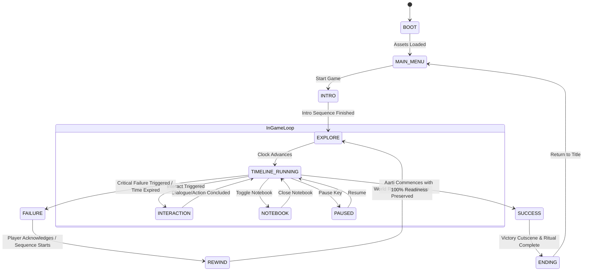
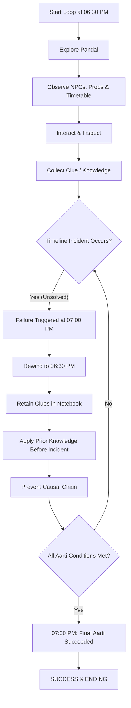

# Phase 0: Project Architecture and Game Design
**Project:** The Final Aarti  
**Genre:** 2D Narrative Time-Loop Puzzle Adventure  
**Theme:** Ganesh Festival / Ganesh Chaturthi  
**Platform:** Desktop Web Browser  
**Target Delivery Date:** September 17, 2026  

---

## 1. Game Design Document (GDD)

### 1.1 High Concept & Premise
In *The Final Aarti*, the player assumes the role of a devoted volunteer at a vibrant community pandal during the culminating evening of Ganesh Chaturthi. The community has gathered for the Grand Aarti (the final ceremonial worship before visarjan). However, a cascading chain of failures ruins the ceremony (e.g., sound mixer blows out, modak offerings go missing, main lamp/diya oil is contaminated, generator runs dry). 

When disaster strikes and the aarti is aborted, time mysteriously rewinds back to the start of the evening. The player retains all collected clues and notebook revelations across loops, allowing them to intervene in advance, solve causal puzzle threads, prevent every failure, and successfully conduct the Final Aarti.

### 1.2 Core Pillars
1. **Time as a Causal Puzzle:** Every loop runs on a synchronized game clock. Events unfold predictably unless the player alters an upstream condition.
2. **Knowledge Persistence:** Physical items reset on rewind, but discoveries, clues, NPC schedules, and timeline facts persist in the player's mental ledger (the Notebook).
3. **Intentional Scope:** A compact, high-density pandal space with focused, interconnected causal chains rather than sprawling, empty maps.

---

## 2. Technical Architecture

### 2.1 Architectural Paradigm
- **Architecture:** Modular, Decoupled Component/Subsystem Architecture using an Event Bus.
- **Rendering & Update Separation:** Fixed timestep update (`dt`) for physics/logic decoupled from interpolation/rendering tick (`requestAnimationFrame`).
- **Input Abstraction:** `InputManager` maps raw keyboard/mouse events to action commands (`MOVE_UP`, `INTERACT`, `OPEN_NOTEBOOK`, `PAUSE`, `DEBUG_TOGGLE`), decoupling hardware events from player controllers.
- **State Management:** Hierarchical Finite State Machine (`FSM`) governing global game states.
- **Content Separation:** Timeline scripts, dialogue trees, NPC routines, and puzzle flags exist strictly as external declarative data structures (JSON/JS object configs), decoupled from engine code.
- **Memory & Allocation Strategy:** Zero-allocation in hot game loops: object pooling for active entities/particles, reused vectors/state structs to avoid GC hitches.
- **Debug Mode:** Unified debug overlay toggled via flag/key (`~` or `F1`), displaying active state, game clock, entity positions, collision bounding boxes, and time-skip controls.

---

## 3. Folder Structure

```
ganeshgame/
├── index.html                   # Entry point, Canvas mount, UI overlay mount
├── css/
│   └── style.css                # Base layout, UI overlays, HUD styling
├── assets/
│   ├── audio/                   # Sound effects, ambient pandal audio, aarti track
│   ├── data/                    # Pure declarative data configs
│   │   ├── timeline.json        # Timeline events, milestones, and trigger points
│   │   ├── puzzles.json         # Puzzle states, prerequisites, and causal links
│   │   ├── dialogue.json        # NPC dialogue branches and notebook reveals
│   │   └── npcs.json            # NPC definitions, schedules, and patrol points
│   └── sprites/                 # Visual sprite sheets and tiles
├── src/
│   ├── main.js                  # Bootloader, initializes Game & Subsystems
│   ├── core/
│   │   ├── Game.js              # Central loop, fixed timestep runner, system orchestrator
│   │   ├── StateMachine.js      # Finite State Machine implementation
│   │   ├── EventBus.js          # Pub/Sub event messaging system
│   │   ├── GameClock.js         # In-game timeline timer, loop countdown, scale factor
│   │   └── Debug.js             # Dev-mode inspector, time-scrubbing, bounding box render
│   ├── input/
│   │   ├── InputManager.js      # Raw event listener and key mapper
│   │   └── Actions.js           # Action command definitions and bindings
│   ├── entities/
│   │   ├── Entity.js            # Base game object (transform, bounds, tags)
│   │   ├── Player.js            # Player entity, movement, and interaction reach
│   │   ├── NPC.js               # NPC entity, waypoint navigation, state reactions
│   │   └── InteractiveObject.js # Props, inspection points, switches, items
│   ├── systems/
│   │   ├── Camera.js            # Viewport follow, screen bounds, camera shake
│   │   ├── InteractionSystem.js # Proximity detection, prompt rendering, interaction triggers
│   │   ├── TimelineSystem.js    # Schedules, timeline evaluation, event triggering
│   │   ├── PuzzleSystem.js      # Causal dependency tracker, puzzle state verification
│   │   ├── FailureSystem.js     # Monitors critical failure triggers, invokes failure state
│   │   ├── RewindSystem.js      # Loop reset sequence, state snapshotting, timeline reset
│   │   ├── NotebookSystem.js    # Persistent knowledge repository across loops
│   │   ├── ReadinessSystem.js   # Preparation readiness / score tracker for Final Aarti
│   │   ├── UIManager.js         # HUD, interaction dialogs, notebook UI, pause screens
│   │   └── AudioManager.js      # Sound playback, loop ambient audio, chimes
│   └── render/
│       ├── Renderer.js          # Canvas 2D render pipeline
│       └── Tilemap.js           # Pandal map layout and collision geometry
└── docs/
    └── phase_0_architecture_and_design.md
```

---

## 4. Game State Diagram



---

## 5. Core Gameplay Loop



---

## 6. Entity List

| Entity Name | Type | Purpose | Interaction / Behaviors |
| :--- | :--- | :--- | :--- |
| **Player (Aarav)** | Controllable | Festival volunteer | Walk (WASD/Arrows), inspect, pick up/place items, trigger dialogue. |
| **Ganesh Murti / Altar** | Static Prop | Focal center of festival | Inspect readiness status, deposit sacred items, final ritual trigger. |
| **Sound Mixer / Amplifier** | Interactive Prop | Pandal audio source | Inspect wiring, fix fuse, prevent short-circuit from spilled water. |
| **Main Generator** | Interactive Prop | Power backup | Check diesel level, inspect fuel line, refill with can before 06:48 PM. |
| **Diya Table & Oil Can** | Interactive Prop | Ceremonial lights | Check oil purity, replace contaminated oil, light brass lamps. |
| **PRASADM / Modak Counter** | Interactive Prop | Sacred offering | Guard offerings, distract hungry stray animals/kids, place cover. |
| **Storage Locker** | Interactive Prop | Tool & supply storage | Contains backup fuse, fresh wick, wrench, spare diesel can. |
| **Notice Board / Schedule** | Static Prop | Timetable display | Read evening itinerary to log scheduled events into notebook. |

---

## 7. NPC List

| NPC ID & Name | Role | Schedule & Behavior | Dialogue / Information Provided |
| :--- | :--- | :--- | :--- |
| **Panditji (Head Priest)** | Ritual Overseer | At altar preparing puja; gets upset and cancels aarti if items are missing at 07:00 PM. | Explains strict requirements for the aarti: 108 pure modaks, unbroken diya flame, uninterrupted shankh audio. |
| **Ramesh (Electrician)** | Sound & Power Tech | Struggles with loose cables near the stage; leaves generator unattended to drink tea at 06:42 PM. | Reveals where the spare fuse is kept; notes the generator leaks if not tightened. |
| **Meera (Catering Lead)** | PRASADM Coordinator | Arranging sweet boxes at 06:30 PM; leaves counter open at 06:40 PM to take phone call. | Laments that stray monkeys or neighborhood dogs keep raiding uncovered sweets if left alone. |
| **Uncle Sharma (Treasurer)** | Pandal Committee Head | Pacing around checking wrist watch; complains about missing storage key. | Mentions he dropped the storage cabinet key near the floral decoration booth. |
| **Chintu (Neighborhood Kid)** | Mischievous Volunteer | Runs between booths; accidentally knocks over bucket of water near the amplifier at 06:50 PM. | If given a chore (task to hold flowers), he stays away from the amplifier wiring. |

---

## 8. Timeline Design

**Loop Duration:** 30 In-Game Minutes (06:30 PM to 07:00 PM). Real-time scaling: 1 in-game minute = 10 real seconds (Total loop time = ~5 minutes).

| Timeline (In-Game) | Event / NPC Action | Failure Consequence (If Unresolved) |
| :--- | :--- | :--- |
| **06:30 PM** | Loop starts. Pandal is busy, lights are on. | Baseline starting point. |
| **06:35 PM** | Uncle Sharma loses storage key near flower stall. | Storage cabinet cannot be opened without finding the key. |
| **06:40 PM** | Meera steps away from PRASADM counter to take phone call. | Modak thali is exposed and raided by animals at 06:46 PM. |
| **06:42 PM** | Ramesh leaves generator room to fetch cutting chai. | Fails to notice fuel line valve is open and leaking. |
| **06:47 PM** | Generator runs dry due to leak; lights flicker. | Power switches to overloaded main line. |
| **06:50 PM** | Chintu runs through backstage, kicks water bucket into amplifier. | Short circuit blows main sound and lights at 06:51 PM. |
| **06:55 PM** | Panditji inspects altar: Diya oil has water drop, modaks missing. | Panditji refuses to start aarti. |
| **07:00 PM** | **The Final Aarti Time:** Grand Aarti is called. | **CRITICAL FAILURE:** Power dead, sound dead, offerings ruined. Loop rewinds. |

---

## 9. Puzzle Dependency Design

```
                          [Sharma's Key (near Flowers)]
                                       │
                                       ▼
                         [Unlock Storage Cabinet]
                                  ┌────┴────┐
                                  ▼         ▼
                    [Wrench & Fuel Hose]   [Spare Fuse & Wicks]
                            │                      │
                            ▼                      ▼
               [Tighten Generator Valve]   [Replace Fragile Diya Wick]
                            │                      │
                            │                      │
[Distract Chintu with Garland]                     │
              │                                    │
              ▼                                    ▼
[Prevent Water Spill on Mixer]             [Inspect & Fill Diya Oil]
              │                                    │
              └──────────────┬─────────────────────┘
                             │
                             ▼
                [Cover PRASADM Counter (at 06:39)]
                             │
                             ▼
      [ALL 4 PILLARS SECURE: Power + Audio + PRASADM + Altar]
                             │
                             ▼
               SUCCESSFUL FINAL AARTI AT 07:00 PM
```

### Dependency Matrix:
1. **Power Chain:** Key $\rightarrow$ Unlock Cabinet $\rightarrow$ Wrench $\rightarrow$ Fix Generator valve before 06:42 PM $\rightarrow$ Generator stays powered.
2. **Audio Chain:** Chintu needs distraction before 06:49 PM $\rightarrow$ Aarav assigns Chintu to flower duty $\rightarrow$ Water bucket is never knocked $\rightarrow$ Sound system remains operational.
3. **Offerings Chain:** Notebook clue from Loop 1 alerts Aarav to Meera's phone call at 06:40 PM $\rightarrow$ Aarav covers PRASADM box or closes counter latch before 06:40 PM $\rightarrow$ Modaks preserved.
4. **Sacred Altar Chain:** Diya oil checked before 06:55 PM + fresh wicks from cabinet $\rightarrow$ Pure uninterrupted flame ready for Panditji.

---

## 10. Implementation Roadmap

### Phase 1: Core Framework & Loop Skeleton
- Set up directory structure and build system / entry points.
- Implement `Game`, `StateMachine`, `EventBus`, and `GameClock`.
- Set up Canvas 2D rendering pipeline and fixed timestep loop.
- Implement `InputManager` with decoupled action bindings.

### Phase 2: World, Entity & Interaction Infrastructure
- Implement `Entity`, `Player`, `InteractiveObject`, and `Camera`.
- Build basic tilemap/boundary collision for the pandal.
- Implement `InteractionSystem` with proximity prompts.

### Phase 3: Time, Timeline & NPC Mechanics
- Build `TimelineSystem` driven by declarative `timeline.json`.
- Implement `NPC` entity with waypoint routines synchronized to the clock.
- Connect in-game clock triggers to NPC actions and world events.

### Phase 4: Time-Loop, Failure & Notebook Systems
- Implement `FailureSystem` detecting abort conditions.
- Implement `RewindSystem` resetting world state while preserving knowledge.
- Implement `NotebookSystem` to store discovered clues, timeline facts, and causal milestones across loops.

### Phase 5: Puzzles, Game Progression & Win Condition
- Integrate `PuzzleSystem` and `ReadinessSystem`.
- Implement all 4 causal chains (Power, Audio, Offerings, Altar).
- Wire `SUCCESS` state, Final Aarti celebration sequence, and `ENDING` transition.

### Phase 6: Polish, Audio & Developer Tooling
- Finalize `UIManager` (dialogue box, notebook modal, HUD clock, readiness gauge).
- Integrate `AudioManager` (pandal ambiance, aarti chimes, failure rewind cue).
- Finalize `Debug` overlay and dev controls.
- Validation and delivery.

---
*Status: Phase 0 architecture and design documentation complete. Halting per stop condition.*
